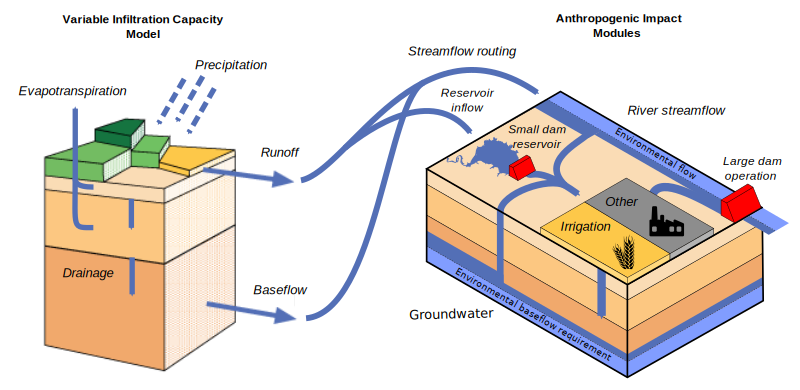

# VIC-WUR Model Overview

!!! note
    You are viewing the documentation for VIC-WUR. VIC-WUR extends the VIC model with several modules to simulate the human impact on global water resources.

## Main Features

The VIC-WUR model ([Droppers et al., 2019](../Documentation/References.md)) is a large-scale semi-distributed hydrological model which is used to assess the human impact on global water resources. As such, several modules are included:

1. Anthropogenic water withdrawal, consumption and return flow for the irrigation, domestic, energy, manufacturing and livestock sector. Water demands for the irrigation sector are calculated by the model while the other sectors require demand (potential withdrawal) inputs.
	- This feature is combined with an integrated routing module
2. Environmental flow requirements for terrestrial ecosystems. Flow requirements are seperated into:
	- Streamflow requirements that limit surface water withdrawals
	- Baseflow requirements that limit groundwater withdrawals
3. Dam reservoir operation. Dam operation is seperated into operations for 'small' (within grid) dams and 'large' dams.

Figure 1: The VIC-WUR model framework

## Integrated routing
Since VIC-5 uses the space-before-time processing order, runoff routing could be simulated each timestep. The routing post-process was replaced by our newly developed routing module which simulates routing sequentially (upstream-to-downstream) to facilitate water withdrawals between cells.

Routing is based on so-called 'unit-hydrographs' (or 'impuls-responce functions'). VIC-WUR uses 2 unit-hydrographs per cell: 1 for the cell runoff (`uh-runoff`) and 1 for the cell inflow (from upstream cells) (`uh_inflow`). See [Droppers et al., 2019](../Documentation/References.md) for more information on how this was calculated in the past.

### Routing inflow forcing
VIC-WUR supports routing inflow forcing data to provided additional water inflow to specific cells. Forcings can be provided at various temporal resolutions (e.g. `FORCE_STEP`, `FORCE_DAY`, `FORCE_MONTH`).

## Water withdrawal, consumption and return flow
VIC-WUR simulates water withdrawal, consumption and return flow for the sectors:

1. Irrigation sector
2. Domestic sector
3. Energy sector
4. Manufacturing sector
5. Livestock sector

To meet water demands (given as forcing input), water can be withdrawn from river streamflow, small (within-grid) reservoirs and groundwater resources. Streamflow withdrawals are abstracted from the grid cell discharge (as generated by the routing module), reservoir withdrawals are abstracted from small dam reservoirs (located in the cell) and groundwater withdrawals are abstracted from the third layer soil moisture. Surface water withdrawals are partitioned between river streamflow and small reservoirs relative to water availability.

When water demands cannot be met, water withdrawals are partitioned between the sectors relative to their demands, restricting each sector by the same relative amount. Withdrawn water is partly consumed, meaning the water evaporates and does not return to the hydrological model. Unconsumed water withdrawals for the domestic, energy, manufacturing and livestock sector are returned as river streamflow. For the irrigation sector, unconsumed irrigation water remains in the soil column and eventually returns as subsurface runoff.

### Water demand, groundwater and consumption forcing
In VIC-WUR, sectoral water demands, groundwater withdrawal fraction and consumption fraction need to be specified for each grid cell. Forcings can be provided at various temporal resolutions (e.g. `FORCE_STEP`, `FORCE_DAY`, `FORCE_MONTH`). Sectors are dynamically included if all forcing files (e.g. demand, groundwater and consumption) are provided. See [Droppers et al., 2019](../Documentation/References.md) for more information on how this was calculated in the past.

### Dynamic irrigation demand calculation
Instead of specifying the irrigation demand via forcing inputs, irrigation can also be calculated dynamically based on the model state. Irrigation demands are set when the soil moisture contents are below the critical point (`Wwcp`) and will try to fill soil moisture up to field capacity (`Wcr` / `Wfc_fract`).

The exception is paddy rice irrigation, where irrigation was also supplied to keep the upper soil layer saturated. Paddy irrigated vegetation can be specified in the irrigation parameters. The saturated soil conductivity in the upper 2 layers is reduced (`Ksat_expt`) to simulate puddling practices.

Total irrigation demands also included transportation and application losses. Note that transportation and application losses are not ‘lost’ but rather returned to the soil column without being used by the crop. Total irrigation demands are adjusted by the irrigation efficiency (`irrigation_efficiency`). Paddy irrigation used an irrigation efficiency of 1 since the water losses were already incorporated in the water demand calculation.

## Environmental flow requirements

## Dam operation
